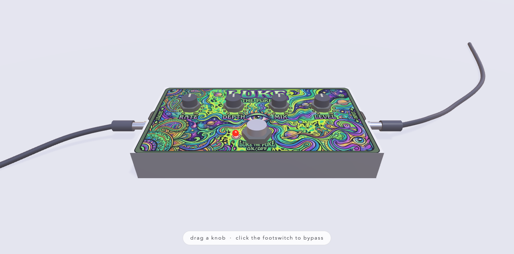

# Pedal Bakery — limitless guitar pedalboards in the browser



Describe a sound — *"a broken church organ underwater, slow and haunted"* —
and a new guitar pedal is baked for you: a 3D enclosure with its own artwork,
knobs and switches that match the sound, and a real Web Audio effect chain
behind them. Drop pedals onto a grid floor, run wobbling cables from jack to
jack (Reason-style), and chain them into an amp. Break the chain and the sound
dies, exactly like a real pedalboard. Feed it the built-in E chord, or plug in
a real guitar through an audio interface.

And bring a friend: every bakery is a **multiplayer room** with an invite
code. Two people on the same board see each other as floating name tags,
watch each other's cursors, and every knob turn, cable pull, and freshly
baked pedal lands on both screens in realtime.

Built with [Babylon.js](https://www.babylonjs.com/) (from CDN) and the Web
Audio API. Plain static files plus one small Python server, no build step.

## Run it

```sh
python3 bakery/server.py
```

Open <http://localhost:8123>, type a name, and **CREATE BAKERY** (the click
doubles as the user gesture browsers require before they allow sound). The
shelf of saved pedals works with no further setup. The **BAKE** button
additionally needs the [Claude Code](https://claude.com/claude-code) CLI
installed and logged in — the server runs `claude -p` headlessly on your
subscription to design pedals. `PORT=8200 python3 bakery/server.py` picks
another port; `?solo=1` on the URL skips the lobby for a quick offline board.

## Bake together

Every session is a room. **CREATE BAKERY** mints a 5-letter invite code
(top-right badge, COPY button); a friend picks **JOIN BAKERY** and types it —
or you send them `http://<your-host>:8123/?room=CODE`. Rooms you have visited
are listed under **YOUR BAKERIES** so you can walk back in later: boards are
saved server-side in `rooms/<code>.json` and survive restarts.

In a shared bakery everything is live for everyone: spawning, dragging,
patching cables, turning knobs, stomping footswitches, changing the tone
post's chord — whoever moves last wins. Each other player appears as a
colored orb with a name tag floating where they're looking, plus a small
dot where their mouse is. Baked pedals land on every floor and every shelf.

Two honest limitations: a **live guitar** plays only on the computer it is
plugged into (other players see the source set to guitar but hear silence —
there is no audio streaming), and the server trusts anyone who knows the
room code. To play across the internet, share the server over Tailscale,
a LAN, or any tunnel that can carry a WebSocket.

## Playing with it

The world starts with a grid floor, one **amp** on the left, and one red
**tone post** on the right. Signal flows right to left, into each pedal's
right-side INPUT jack and out its left-side OUTPUT. Add more tone posts and
amps from the shelf — each post has its own sound (sustained chord with a
dry-electric-guitar voicing, a plucked arpeggio, or your real guitar), and
every complete post→pedals→amp path plays simultaneously.

| Action | Effect |
| --- | --- |
| shelf (left panel) | click a pedal — or drag it straight onto the floor |
| + TONE IN / + AMP chips | add more sources and amps — several tones at once, parallel chains |
| + DRUMS chip | a synthesised kit that plays along; cable it to an amp like anything else |
| + BASS chip | a bass that takes the band's line, key and changes; cable it to an amp too |
| type a sound + BAKE | a new pedal is designed, saved to the shelf, and dropped |
| drag a pedal / amp / source | move it (snaps to the grid); pedals dropped off the grid are removed |
| Delete / Backspace | remove the selected (outlined) pedal |
| click an OUTPUT jack | a cable dangles from it and follows your mouse |
| then click an INPUT jack | the cable connects (amp counts; Esc or click away cancels) |
| click a connected jack | pull that cable out |
| click a knob + drag up/down | turn it (0–10) |
| click the footswitch | bypass that pedal (dry passes through — the LED shows it) |
| click a red tone post | menu: chord flavors (major…power) · arpeggio mode · unplugged · guitar · drums |
| a drum post's menu | 19 grooves and 5 kits, or leave it on FOLLOWS THE BAND and it picks to match |
| a bass post's menu | 15 lines and 4 tones, and by default it follows the band's line, key and changes |
| left-drag empty floor | pan around the room (Google-Maps style) |
| right-drag / scroll | orbit and zoom |

**No sound?** Follow the cables: the source must reach the amp. A broken
chain is silence — that's the rule.

## How it works

Everything is driven by one JSON **pedal spec** — what the bakery LLM
produces, what every file in `specs/` is, and the only thing the app loads:

```json
{ "name": "Drowned Cathedral",
  "enclosure": { "width": 3.2, "depth": 2.4, "height": 0.6, "color": "#1c3a34" },
  "artwork":   { "style": "burst", "palette": ["#0b1f24", "#2e6b5e", "#9fbfae"], "textColor": "#dce8d9" },
  "chain":     [ { "id": "warp", "type": "chorus", "params": { "rate": 1.5, "depth": 8 } } ],
  "controls":  [ { "id": "k2", "label": "SLOW", "target": "warp.rate" } ],
  "switches":  [ { "id": "s1", "label": "SEANCE", "target": "warp.mix", "off": 6, "on": 10 } ] }
```

The `chain` is composed from a curated module library — the LLM never writes
DSP, so a weird generation can only be boring, never broken. All params live
in knob-space 0–10; each module owns its curve to real units. Modules:
**drive, delay, chorus, tremolo, filter, phaser, reverb, ring, comp, level**
(`js/modules.js`). Pedals range from one-knob minis to eight-knob consoles;
the server bumps box sizes to fit big knob counts.

```
index.html            page shell: canvas, shelf, bakery bar, HUD
js/config.js          shared constants (the E chord)
js/modules.js         the effect building blocks (Web Audio DSP)
js/audio.js           engine: sources + per-pedal rigs + chain routing + amp
js/board.js           pure data: who is cabled to whom, chain resolution
js/layout.js          spec -> (u,v) face-plate positions for every control
js/artwork.js         procedural face-plate painting (canvas)
js/scene.js           Babylon world: grid, amp, source post, pedals, cables
js/main.js            the wiring: interactions, shelf, bakery — start here
bakery/server.py      static files + /specs + /bake (claude -p + cache)
specs/*.json          the shelf; baked pedals are saved here automatically
```

Separation rules that keep it modular: `board.js` knows no 3D and no audio;
`audio.js` knows no 3D; `scene.js` knows no audio; specs are the only
currency between them. `main.js` is the only file that touches everything.

## The audio path

```
chord osc bank ─┐                     ┌ pedal rig ┐  ┌ pedal rig ┐
guitar in ──────┴─ sourceBus ── ─ ─ ──┤ (bypass)  ├──┤ (bypass)  ├── ─ ─ ── amp
                     (wired only when the cable chain reaches the amp)
```

Each pedal on the floor owns a persistent "rig" (its module chain + true
bypass). Connecting cables just rewires gain nodes — instant, no rebuilds.

## The bakery and its cache

`POST /bake` first checks the shelf: every baked spec stores its original
description (`bakedFrom`), and a new description is compared against them
(normalized text, max of word-set Jaccard and character-sequence similarity;
≥ 0.8 counts as the same idea). A hit returns the saved pedal instantly.
Otherwise Claude designs a new spec, the server validates and clamps it
(module types, targets, ranges, colors, box-size coherence), saves it to
`specs/baked-*.json`, and it joins the shelf permanently.

## Live guitar in

Click the source post until it says GUITAR and allow microphone access. The
app disables the browser's voice-call processing, prefers a Focusrite/Scarlett
device if present, and takes channel 1 (the instrument jack) as mono. Use INST
mode on the interface, monitor through the computer, keep direct-monitor off
(it doubles the dry signal and pans input 1 to one ear on a 2i4). Expect
10–25 ms round-trip latency — browsers are not hardware pedals.

## Hacking on it

- **New pedal by hand**: drop a JSON file into `specs/` — it's on the shelf
  after a reload.
- **New effect module**: add a factory to `js/modules.js` (in/out nodes +
  0–10 param setters), register it in `MODULES` there **and** in
  `bakery/server.py` so the LLM knows it exists.
- **Bakery prompt**: `PROMPT` in `bakery/server.py` is the whole creative
  brief — tune it to taste.
- **Automation / testing**: `window.__pedal` exposes `instances()`, `spawn`,
  `remove`, `connect`, `disconnect`, `chain()`, `set`, `state`, `screenPos`
  and more; `index.html` collects uncaught errors in `window.__errors`. The
  app is verified headlessly with synthetic pointer events against these.
